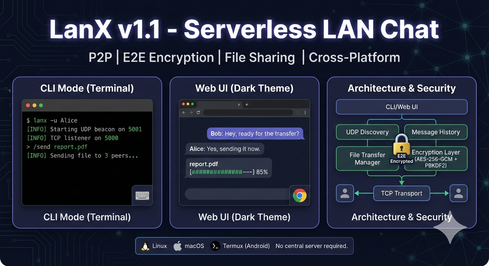
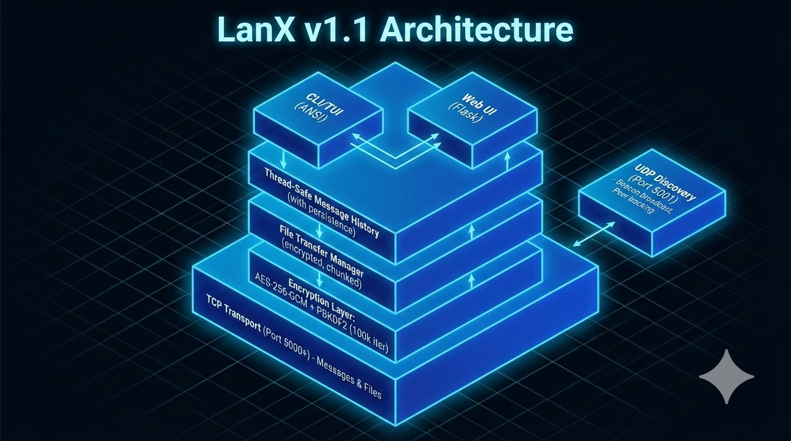

# LanX - Serverless LAN Chat

A lightweight, peer-to-peer LAN chat application with multi-layered end-to-end encryption and file sharing. Compatible with standard Linux distributions and Termux on Android.



## Features

- **Serverless P2P Architecture**: No central server required. Direct peer-to-peer communication.
- **UDP Discovery**: Automatic peer discovery via broadcast beacons
- **TCP Transport**: Reliable message delivery via direct socket connections
- **Multi-Layered Encryption**: AES-256-GCM with PBKDF2 key derivation (100,000 iterations)
- **Encrypted File Sharing**: Send files up to 100MB with end-to-end encryption
- **Message Persistence**: Automatic chat history save/load
- **Configuration Management**: JSON-based config with CLI overrides
- **Logging System**: Comprehensive logging to `~/.lanx/lanx.log`
- **Dual Interface Modes**:
  - CLI/TUI Mode: Terminal-based interface using ANSI escape codes
  - Web UI Mode: Flask-based minimalist dark theme web interface
- **Cross-Platform**: Works on Linux, macOS, and Termux (Android)

## Installation

### Method 1: Global Installation (Recommended)

```bash
# Clone or download the repository
cd lanx-chat

# Install globally
pip install .

# Or install in development mode
pip install -e .

# Now you can run 'lanx' from anywhere
lanx --help
```

### Method 2: Local Installation

```bash
# Install dependencies
pip install -r requirements.txt

# Run directly
python lanx.py
```

### Requirements

- Python 3.7+
- `cryptography` library
- `flask` library (only for web mode)

## Usage

### Basic Usage (CLI Mode)

```bash
# Start with default settings
lanx

# Start with custom username
lanx -u Alice

# Start with custom TCP port
lanx -p 5005
```

### Web UI Mode

```bash
lanx --web
```

Then open http://127.0.0.1:8080 in your browser.

### Command Line Options

```
lanx [-h] [-w] [-u USERNAME] [-p PORT] [--web-port WEB_PORT]
     [-c CONFIG] [--no-save] [--log-level {DEBUG,INFO,WARNING,ERROR}]
     [-v]

Options:
  -h, --help            Show help message and exit
  -w, --web             Start in web UI mode (default: CLI)
  -u, --username USERNAME
                        Your username (default: hostname or from config)
  -p, --port PORT       TCP port for messaging (default: 5000 or from config)
  --web-port WEB_PORT   Web UI port (default: 8080 or from config)
  -c, --config CONFIG   Path to config file
  --no-save             Do not save chat history
  --log-level {DEBUG,INFO,WARNING,ERROR}
                        Logging level (default: INFO)
  -v, --version         Show version and exit
```

### Examples

```bash
# Start web UI on custom port
lanx -w --web-port 8888

# Use custom config file
lanx -c /path/to/config.json

# Debug mode with verbose logging
lanx --log-level DEBUG

# Don't save chat history
lanx --no-save
```

## CLI Commands

When in CLI mode, use these slash commands:

| Command | Description |
|---------|-------------|
| `/quit`, `/exit`, `/q` | Exit the application |
| `/peers` | List connected peers |
| `/send <filepath>` | Send file to all peers |
| `/files` | Show file transfer status |
| `/search <query>` | Search message history |
| `/clear` | Clear chat history |
| `/save` | Manually save chat history |
| `/downloads` | Show downloads folder path |
| `/help` | Show help message |

### File Sharing Examples

```bash
# Send a file to all connected peers
/send ~/Documents/report.pdf

# Send an image
/send ~/Pictures/photo.jpg

# Check file transfer status
/files
```

## Configuration

LanX stores configuration in `~/.lanx/config.json`. You can customize:

```json
{
  "username": "MyUser",
  "tcp_port": 5000,
  "udp_port": 5001,
  "web_port": 8080,
  "download_dir": "/home/user/.lanx/downloads",
  "save_history": true,
  "max_history": 1000,
  "log_level": "INFO",
  "theme": "dark"
}
```

Configuration is automatically saved when you set options via CLI arguments.

## File Structure

```
~/.lanx/
├── config.json          # Application configuration
├── history.pkl          # Saved chat history (if enabled)
├── lanx.log             # Application logs
├── downloads/           # Received files
└── temp/                # Temporary files during transfer
```

## How It Works

### Discovery (UDP)

When LanX starts, it spawns a background thread that broadcasts a UDP beacon (`LANX_HELLO:[username]:[port]`) every 3 seconds. Other LanX instances listening on the same UDP port receive these beacons and maintain a live dictionary of active peers. Stale peers (no beacon for 15 seconds) are automatically removed.

### Transport (TCP)

Messages and files are sent via direct TCP socket connections:
- **Messages**: `[length(4 bytes)][encrypted_payload]`
- **Files**: `[FILE_MAGIC][meta_length(4)][encrypted_metadata][chunks...]`

### Encryption

1. **Key Derivation**: The Room Password is processed using PBKDF2-HMAC-SHA256 with 100,000 iterations to derive a 256-bit AES key.
2. **Message Encryption**: Each message is encrypted using AES-256-GCM with a unique 96-bit nonce.
3. **File Encryption**: Files are encrypted as a whole using AES-256-GCM before transmission.
4. **Payload Format**: `[salt(16 bytes)] + [nonce(12 bytes)] + [ciphertext + auth_tag]`

Only peers with the exact same Room Password can decrypt messages and files.

### File Sharing

Files are transferred using a chunked approach:
1. Sender encrypts the entire file
2. Metadata (filename, size, chunks) is sent first
3. File is split into 64KB chunks and sent sequentially
4. Receiver reassembles and decrypts the file
5. File is saved to `~/.lanx/downloads/`

Maximum file size: 100MB

## Architecture




```
┌─────────────────────────────────────────────────────────────────────────┐
│                           LanX v1.1                                      │
├─────────────────────────────────────────────────────────────────────────┤
│  ┌──────────────┐  ┌──────────────┐  ┌──────────────────────────────┐  │
│  │   CLI/TUI    │  │   Web UI     │  │   UDP Discovery (Port 5001)  │  │
│  │   (ANSI)     │  │  (Flask)     │  │   - Beacon broadcast         │  │
│  └──────┬───────┘  └──────┬───────┘  │   - Peer tracking            │  │
│         │                 │          └──────────────────────────────┘  │
│  ┌──────┴─────────────────┴─────────────────────────────────────────┐  │
│  │              Thread-Safe Message History (with persistence)        │  │
│  └──────────────────────────┬────────────────────────────────────────┘  │
│                             │                                           │
│  ┌──────────────────────────┴────────────────────────────────────────┐  │
│  │              File Transfer Manager (encrypted, chunked)            │  │
│  └──────────────────────────┬────────────────────────────────────────┘  │
│                             │                                           │
│  ┌──────────────────────────┴────────────────────────────────────────┐  │
│  │         Encryption Layer: AES-256-GCM + PBKDF2 (100k iter)        │  │
│  └──────────────────────────┬────────────────────────────────────────┘  │
│                             │                                           │
│  ┌──────────────────────────┴────────────────────────────────────────┐  │
│  │              TCP Transport (Port 5000+) - Messages & Files         │  │
│  └────────────────────────────────────────────────────────────────────┘  │
└─────────────────────────────────────────────────────────────────────────┘
```

## Compatibility

### Tested On

- Ubuntu 20.04+ / Debian 11+
- macOS 12+
- Termux (Android 10+)

### Port Requirements

| Port | Protocol | Purpose |
|------|----------|---------|
| 5000+ | TCP | Message and file transport |
| 5001 | UDP | Peer discovery |
| 8080 | TCP | Web UI (localhost only) |

All ports are configurable. Using ports 5000+ avoids requiring root privileges.

## Troubleshooting

### "Failed to bind UDP port"

Another instance may be running. Use a different port:
```bash
lanx -p 5005
```

### "Flask not installed"

Install Flask for web mode:
```bash
pip install flask
```

### Messages not reaching peers

1. Ensure all peers use the same Room Password
2. Check firewall settings (allow UDP 5001 and TCP 5000+)
3. Verify all devices are on the same network/subnet
4. Check logs: `tail -f ~/.lanx/lanx.log`

### File transfers failing

1. Check available disk space
2. Verify file is under 100MB limit
3. Check write permissions in `~/.lanx/downloads/`
4. Ensure stable network connection

### Termux keyboard issues

The CLI mode uses ANSI escape codes (not curses) for better compatibility with virtual keyboards.

## Security Notes

- The Room Password is **never transmitted** over the network
- Each message uses a **unique nonce** for AES-GCM
- Salt is included with each message for decryption flexibility
- Authentication tag prevents tampering
- Files are encrypted **before** transmission
- Web UI only binds to localhost (127.0.0.1) for security

## Development

```bash
# Install development dependencies
pip install -e ".[dev]"

# Run tests
pytest

# Code formatting
black lanx.py

# Linting
flake8 lanx.py
```

## Version History

- **v1.1** (Current)
  - Global pip installation support (`setup.py`)
  - Encrypted file sharing (up to 100MB)
  - Message persistence (save/load history)
  - Configuration file support (`~/.lanx/config.json`)
  - Logging system
  - Message acknowledgments
  - Search functionality
  - Improved CLI commands
  - Web UI file upload support

- **v1.0**
  - Initial release
  - P2P serverless architecture
  - UDP discovery + TCP transport
  - AES-256-GCM encryption
  - CLI and Web UI modes

## License

GNU GPLv3.

## Contributing

Contributions are welcome! Please feel free to submit issues or pull requests.

## Acknowledgments

- Built with [Flask](https://flask.palletsprojects.com/)
- Cryptography powered by [cryptography](https://cryptography.io/)
